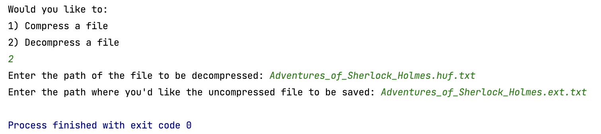

# Huffman Coding Lab

For this lab assignment you are going to create a text file compression program.  To accomplish this us the Huffman tree as described in the Huffman Coding Handout by Owen L. Astrachan and Chapter 30.1 of your text.  

Your program should ask the user if they wish to encode or decode a file, then prompt the user for the file path of the file to open, then prompt the user for a filename to save the new file under.  It should then open the file encode or decode the content and save it to the new file path entered.  

If you code your program well you should be able to compress the larger text file examples to almost half their original size. 

## Developing and testing:
This time there are no automated tests for you to use or any starting code, it's all up to you.  I might recommend starting with a Huffman ADT class with encode and decode interface methods, but it's up to you. You can and should use STD Container libraries for Hash Tables, Unordered Lists, Priority Queues if you need them, but you ***must code the Huffman tree yourself***. I've included a few example files you can use to test your program.  

Below in this ReadMe file add a short description of how to use your program and how it is implemented.  Include some results from your compression tests, how much are you able to compress a large text file? 

## Your program needs to:

1. Ask the user if they want to compress of decompress a file.  
2. Get input file path.
3. Get a path to save the new compressed or decompressed file.
4. And then exit.  Your program should **not** remain open between compression and decompression sessions. 

### Example of running the program to compress a file:

### Example of running the program to decompress a file:

## Writing to a binary file. 
One of the things this assignment requires is that you be able to write a binary string as a binary file.  Since this is outside the scope of this class I've included a Storage Class for you to use or emulate.  The Storage driver will take Binary string chunks and store them to a binary file.  It will also open a binary file and return to you binary string chunks 8 bits at a time. It will also allow you to store and read header information that you'll need to stash and rebuild your huffman tree. See the StorageDriver.cpp for an example of how to use the Storage Class. 

## Huffman Node and using a priority queue
I've also included a Node.h file that can be used for the huffman tree or as an example.  When putting Node pointers in a stl priority queue you'll need to let the queue know how to compare two nodes.  The struct compareWeights in the Node.h file does exactly this.  You can find more information here: https://www.geeksforgeeks.org/stl-priority-queue-for-structure-or-class/

**Grading rubric 100 points for the first lab assignment**

| Points | Requirements                                                                                                                                                                                                                                                                               |
|--------|--------------------------------------------------------------------------------------------------------------------------------------------------------------------------------------------------------------------------------------------------------------------------------------------|
| 30     | Huffman Tree: You code demonstrates the ability to create a Huffman tree.                                                                                                                                                                                                                  |
| 30     | Encoding:  Your program is able to encode a string using the Huffman tree.                                                                                                                                                                                                                 |       
| 30     | Decoding: Your program is able to decode a string using the Huffman tree.                                                                                                                                                                                                                  |       
| 15     | File IO:  You program is able to open encode/decode and save a file correctly.  Including some form of storing the a representation of the huffman tree in the encoded file.                                                                                                               |        
| 15     | Large Files:  Your program is capable of handling large file by incrementally reading in the file while creating and encoding/decoding the Huffman tree.                                                                                                                                   |       
| 10     | Short write up, appended to this readme, describing both how to use your program and how it is implemented.                                                                                                                                                                                          |        
| 20     | Good coding practices, including: self-commenting variable names, one statement per line, properly indenting and spacing, good  descriptive comments, and a lack of coding errors like memory leaks. **Create documenting comments for each method public and private**  |

## Enter you description below:
Moby Dick compressed from 1.3mb to 708k. This is around a 65% of its original size
My program is implemented in two phases. A compress and a decompress. 

The compress function first reads in the contents of the file and create a count of each character. The count of the characters are stored in a map with the key being the character and the value being the frequency of this character. Then we take the map and store it into a priority queue which will tell us how to create our tree. The tree is created by adding Nodes, which carry the characters and its frequency, with the lowest frequency first. Once our map is created, we can traverse the tree to generate the new binary code for each character. Next we will create a string called header which will contain each character followed by its binary paring (example: g0110). We will then store the header into a Storage object. Using the map we will translate each character into its binary counterpart and insert that into a new file using Storage's insert function. 

To decompress a compressed file we will create a Storage object and grab the first line of the compressed file, this will be the header. We will use the header to generate a new tree reverseing the method we used to create it in our compress function. Once we have our reconstructed tree, we will call extract from Storage to read in the binary from the compressed file and use the reconstructed tree to get our corresponding character. We take these characters and recreate our file. 

